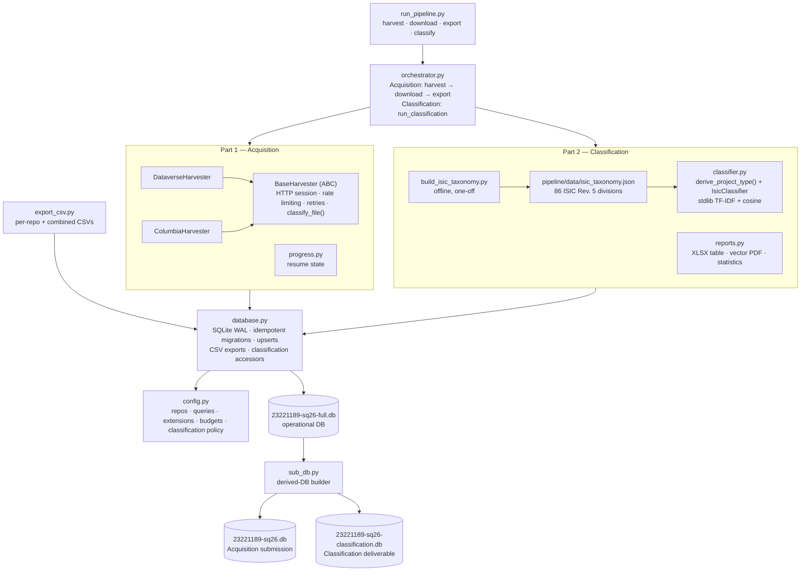

# Seeding QDArchive

A Python pipeline for discovering and cataloging qualitative research data across open repositories. Built as part of the QDArchive project at FAU, where the long-term goal is to create an open archive for qualitative data analysis (QDA) files : think `.qdpx`, NVivo, MAXQDA, ATLAS.ti project files that researchers can actually reuse.

Right now, the pipeline covers two parts for two assigned repositories:
**Part 1 — Acquisition** (harvest metadata + download files) and **Part 2 —
Classification** (assign each project a type and an ISIC Rev. 5 economic-sector
division).

| # | Dataset | URL |
|---|---------|-----|
| 10 | Harvard Dataverse | [dataverse.harvard.edu](https://dataverse.harvard.edu/) |
| 19 | Columbia Oral History Archive | [dlc.library.columbia.edu](https://dlc.library.columbia.edu/) |

> **Status:** Part 1 (Acquisition) and Part 2 (Classification) are both implemented.
> Part 3 (Analysis) is future work.

---

## Motivation

There is a chicken-and-egg problem in qualitative research: no one shares QDA project files because there is no infrastructure for it, and no one builds the infrastructure because there aren't enough shared files to justify it. The REFI-QDA standard (`.qdpx`) exists to make QDA files interoperable between software like MAXQDA, NVivo, and ATLAS.ti but adoption is low because researchers don't have a place to publish or discover these files.

QDArchive is an attempt to break that cycle. Before building the archive itself, we need to understand what is already out there: which repositories host qualitative research data, what formats it's in, and whether any QDA project files exist in the wild.

That is what this pipeline does it systematically : searches repositories, collects metadata about every project and file it finds, classifies files by type (analysis, primary data, additional), and tracks everything in a local SQLite database.

---

## Project Structure

```
QDArchive-Project/
├── pipeline/
│   ├── harvesters/
│   │   ├── base.py             # Abstract base : HTTP session, rate limiting, retries, file classification
│   │   ├── columbia.py         # Columbia DLC harvester (Blacklight JSON API)
│   │   └── dataverse.py        # Harvard Dataverse harvester (Dataverse Search API)
│   ├── data/
│   │   └── isic_taxonomy.json  # ISIC Rev. 5 division corpus 
│   ├── __init__.py
│   ├── config.py               # Config : repos, queries, extensions, limits, classification settings
│   ├── database.py             # SQLite schema, idempotent migrations, CRUD, CSV export, classification helpers
│   ├── orchestrator.py         # Coordinates harvest / download / classification phases
│   ├── progress.py             # Harvest progress/resume state tracker
│   ├── classifier.py           # Project-type derivation + ISIC TF-IDF/cosine classifier (stdlib)
│   └── reports.py              # XLSX table + vector PDF report + statistics
├── data/                       # Downloaded files (gitignored)
├── exports/                    # CSV exports (gitignored) + Classification deliverables (tracked)
├── .gitignore
├── 23221189-sq26-full.db            # Operational DB 
├── 23221189-sq26.db                 # Submission DB 
├── 23221189-sq26-classification.db  # Classification DB 
├── LICENSE
├── README.md
├── build_isic_taxonomy.py      # Builds pipeline/data/isic_taxonomy.json from the ISIC5 workbook
├── export_csv.py               # CLI : export the operational DB to per-repo & combined CSVs
├── sub_db.py                   # CLI : build the acquisition & classification DBs from the operational DB
├── requirements.txt            # requests + openpyxl + reportlab
└── run_pipeline.py             # CLI entry point : harvest / download / export / classify

```

> **Three-database layout.** The pipeline writes to `23221189-sq26-full.db` (the
> *operational* DB : all analytics, the `technical_challenges` log, and the Part 2
> classification columns). `23221189-sq26.db` is the **Acquisition**
> DB. `23221189-sq26-classification.db` is the **Classification deliverable** : the submission
> schema plus classification columns, so the Acquisition submission DB is never modified.

---

## How the Pipeline Works

**Part 1 : Acquisition** runs in three sequential phases (harvest → download → export):

### Phase 1 — Harvest

Searches each repository using 25 configured search queries (13 CAQDAS tool names + 12 methodology keywords) tool-specific terms like `"qdpx"`, `"MAXQDA"`, `"NVivo"`, `"ATLAS.ti"` plus quoted methodology phrases like `"qualitative data analysis"`, `"thematic analysis"`, `"grounded theory"`. For each result, it pulls project-level metadata (title, authors, DOI, description, license, keywords) and a file manifest (filenames, sizes, extensions, download URLs). Everything goes into the SQLite database using upsert logic, so re-running the pipeline updates existing records without creating duplicates.

**Harvard Dataverse:** Uses the standard Dataverse Search API (`/api/search`) in two phases:
- **Phase A (dataset search):** Searches with `type=dataset` to find datasets whose metadata matches the queries. For each result, a detail request to `/api/datasets/:persistentId/` fetches the file manifest.
- **Phase B (file search):** Searches with `type=file` to find files by name including all 42 QDA extension patterns (e.g. `*.qdpx`, `*.nvp`, `*.atlproj`). This catches datasets that contain QDA files but don't mention QDA terms in their metadata. Parent datasets discovered this way are fetched and registered automatically.

For harvested datasets (indexed on Harvard but hosted elsewhere, e.g. Borealis, DANS, e-cienciaDatos), the detail API returns 401. In those cases, a fallback extracts file information from the search index itself.

**Columbia Oral History:** Uses the DLC Blacklight JSON API (`/catalog.json`), which was discovered empirically. Columbia's web interfaces are behind Anubis bot protection, but appending `.json` to catalog URLs returns structured data that works fine with `requests`. The harvester filters by `f[lib_repo_short_ssim][]=Oral History Center` and runs a two-phase approach: a broad sweep of the collection plus targeted keyword queries.

### Phase 2 — Download

Uses a **two-pass strategy** with a shared global byte budget:

- **Pass 1 (QDA-first):** Downloads only analysis files (QDA extensions) across all repos. Retries previously failed downloads. For Columbia, saves full JSON metadata per project.
- **Pass 2 (remaining):** Downloads primary and additional data files from Harvard Dataverse projects until the budget is exhausted.

Harvard Dataverse files download via `/api/access/datafile/<fileId>`. Columbia content is streaming-only, the harvester saves the full API metadata JSON as `metadata.json` in each project’s directory.

### Phase 3 — Export

Exports the database to CSV files, separated by repository. Each repo gets its own directory under `exports/` with `projects.csv`, `files.csv`, `keywords.csv`, `person_role.csv`, `licenses.csv`, and `technical_challenges.csv`. A `combined/` directory merges everything.

---

## Part 2 — Classification

After acquisition, the pipeline classifies the harvested catalog on two independent
axes:

### 1. Project type

Every project gets a `type` (`PROJECT_TYPE` enum), derived **from its file manifest**
(reusing the `file_category` computed during acquisition no new extension lists):

- `QDA_PROJECT` : has a QDA analysis file
- `QD_PROJECT` : no QDA file, but has primary data files
- `OTHER_PROJECT` : has files, but no primary data files
- `NOT_A_PROJECT` : nothing can be derived about file types

### 2. ISIC Rev. 5 division

Every `QDA_PROJECT` and `QD_PROJECT` —d and each of its **primary data files**
individually, is classified into an **ISIC Rev. 5 division** using a dependency-light
**TF-IDF + cosine-similarity** classifier (`pipeline/classifier.py`, standard library
only) over the 86-division corpus in `pipeline/data/isic_taxonomy.json`. That corpus is
built once from the official ISIC5 workbook by `build_isic_taxonomy.py` (Title + Includes
text; `Excludes` dropped as a negative signal). The classifier records:

- `primary_class` (division code, e.g. `R86`) and an optional `secondary_class`
  (runner-up, only above a similarity ratio),
- a persisted `classification_confidence` with a configurable floor : weak matches are
  left `NULL` rather than forced into a wrong division (**no default bucket**),
- searchable `tags` (top TF-IDF terms), stored separately from human keywords.

### Deliverables (spec Step 4)

- **`23221189-sq26-classification.db`** : derived from the operational DB
  (submission schema + classification columns; git-tag `classification-results`).
- **`23221189-sq26-classification.xlsx`** : the required table
  (`repository_id, project_type, project_title, primary_class, secondary_class, no_project_files`),
  styled, with a Summary sheet.
- **`23221189-sq26-classification-report.pdf`** : a professional
  **vector** PDF : histograms, top-20 ranked tables, and comments.
- Per-repository statistics + a data-challenges summary printed to the console.

---

## Code Architecture



- **BaseHarvester** : Abstract base class. Manages an HTTP session with a custom User-Agent, rate limiting between requests, and retry logic with exponential backoff (handles 429 Too Many Requests with Retry-After). Also has `classify_file()` which categorizes files as `analysis` (QDA extensions), `primary` (common data formats), or `additional` based on their extension.

- **DataverseHarvester** : Implements harvesting for any Dataverse installation. Two-phase search: dataset-level search for metadata matches + file-level search for QDA file patterns. Includes a fallback for harvested datasets whose detail API returns 401. Updates QDA file counts per project after registering files.

- **ColumbiaHarvester** : Custom harvester for Columbia's Digital Library Collections platform. Parses Fedora repository metadata, registers child resources (audio, video, text) as files with guessed extensions based on format type. Downloads full JSON metadata per project since DLC media is auth-gated and not directly accessible.

- **Database** : SQLite with WAL mode and foreign key enforcement. Five tables: `projects`, `files`, `keywords`, `person_role`, and `licenses`. Column names follow the schema: `file_name`, `status` with `DOWNLOAD_RESULT` enum (`SUCCEEDED`, `FAILED_TOO_LARGE`, `FAILED_SERVER_UNRESPONSIVE`, `FAILED_LOGIN_REQUIRED`). Supports upsert on `(source_repository, source_id)` to prevent duplicates.

- **Orchestrator** : Factory pattern for creating harvesters based on repository type. Coordinates the pipeline phases. Downloads use a two-pass strategy: Pass 1 fetches QDA (analysis) files first, Pass 2 fetches remaining files. Both share a global byte budget (`MAX_TOTAL_DOWNLOAD_GB`). Also exposes `run_classification()` : the Classification phase that derives project types and runs the ISIC classifier over `QDA_PROJECT` + `QD_PROJECT` projects and their primary files.

- **Classifier** (`pipeline/classifier.py`) : Classification engine, **standard library only**. `derive_project_type()` reduces a project's file categories to a `PROJECT_TYPE`; `IsicClassifier` fits a TF-IDF model over the 86 ISIC divisions and ranks project/file text by cosine similarity (no default bucket, similarity-gated secondary, persisted confidence, tags).

- **Reports** (`pipeline/reports.py`) : Classification deliverables. `export_xlsx()` (openpyxl) writes the six-column table; `generate_pdf()` (reportlab) builds the professional vector report; `print_statistics()` prints per-repo stats and the data-challenges summary. Report dependencies are imported lazily, so the acquisition pipeline never requires them.

- **Progress tracker** (`pipeline/progress.py`) : JSON-backed resume state for harvests. Persists per-query pagination offsets and completed queries (atomic writes), so interrupted runs continue where they stopped; stale state (>72 h) is cleared automatically.

- **Derived-DB builder** (`sub_db.py`) : builds the two deliverable databases from the operational DB: Part 1 Acquisition DB, and the Part 2 Classification DB (submission schema + classification columns). The operational DB is never mutated by either build, and both outputs are reproducible at any time.

---

## Getting Started

### Prerequisites

- Python 3.10+
- `pip`

### Installation

```bash
git clone https://github.com/annus3/QDArchive-Project.git
cd QDArchive-Project
pip install -r requirements.txt
```

**Acquisition** needs only `requests`. **Classification** adds two
report/export libraries : `openpyxl` (XLSX) and `reportlab` (vector PDF); the classifier
core itself is standard-library only. All three are listed in `requirements.txt`.

### Running the Pipeline

```bash
# Full pipeline — harvest metadata + download files + export CSVs
python run_pipeline.py

# Harvest only (collect metadata, skip downloads)
python run_pipeline.py --harvest-only

# Specific repositories
python run_pipeline.py --repos harvard_dataverse
python run_pipeline.py --repos columbia_oral_history

# Custom search queries (overrides the 25 default queries)
python run_pipeline.py --queries "qdpx" "NVivo qualitative" "interview transcript"

# Only download projects that contain QDA files
python run_pipeline.py --qda-only

# Verbose logging
python run_pipeline.py --log-level DEBUG

# Part 2 — classify the existing database + generate deliverables (classification DB, XLSX, PDF)
python run_pipeline.py --classify-only

# Run acquisition, then Part 2 classification, in one go
python run_pipeline.py --classify
```

### Exporting to CSV

```bash
# Export per-repo + combined CSVs
python export_csv.py

# Export only one repository
python export_csv.py --repo harvard_dataverse

# Custom output directory
python export_csv.py --output ./my_exports
```

---

## Configuration

All settings live in `pipeline/config.py`:

| Setting | Default | What it controls |
|---------|---------|------------------|
| `SEARCH_QUERIES` | 25 queries | Combined Tier 2 (13 tool names) + Tier 3 (12 methodology keywords) |
| `MAX_RESULTS_PER_QUERY` | 250 | Cap on results per query to prevent runaway pagination |
| `MAX_FILE_SIZE_MB` | 0 (no limit) | Files larger than this (MB) are skipped; 0 = download all |
| `MAX_TOTAL_DOWNLOAD_GB` | 6 | Global download budget in GB; 0 = unlimited |
| `DOWNLOAD_TIMEOUT_SECONDS` | 600 | Per-file download timeout (10 minutes) |
| `MAX_RETRIES` | 3 | Retry attempts for failed HTTP requests |
| `QDA_EXTENSIONS` | 42 types | File extensions recognized as QDA analysis files |
| `PRIMARY_DATA_EXTENSIONS` | ~30 types | Extensions classified as primary research data |
| `REPOSITORIES` | 2 repos | Repository definitions (URL, type, rate limit) |
| `BATCH_COMMIT_SIZE` | 50 | Commit to DB every N operations (batch writes) |
| `PROGRESS_FILE` | `qdarchive.progress.json` | Path to harvest progress/resume state file |
| `ISIC_TAXONOMY_PATH` | `pipeline/data/isic_taxonomy.json` | ISIC Rev. 5 division corpus |
| `SECONDARY_MIN_RATIO` | 0.6 | Report a `secondary_class` only if its similarity ≥ this × the primary |
| `MIN_PRIMARY_CONFIDENCE` | 0.05 | Below this cosine similarity, a project/file is left unclassified (NULL) |
| `CLASSIFICATION_TAG_COUNT` | 8 | Number of top TF-IDF terms kept as searchable tags per project |

The 25 search queries are organized into a **3-tier system** defined in `pipeline/config.py`:

- **Tier 1** (42 extension patterns): Handled by file-level search in the Dataverse harvester (`*.qdpx`, `*.nvp`, etc.)
- **Tier 2** (13 tool queries): `qdpx`, `REFI-QDA`, `MAXQDA`, `NVivo`, `ATLAS.ti`, `QDA Miner`, `QDAcity`, `f4analyse`, `Dedoose`, `Quirkos`, `HyperRESEARCH`, `Kwalitan`, `CAQDAS`
- **Tier 3** (12 methodology queries): `"qualitative data analysis"`, `"thematic analysis"`, `"grounded theory"`, `"qualitative coding"`, and more

QDA extensions are recognized from 9 tools (42 extensions total):
- **REFI-QDA:** `.qdpx`
- **MAXQDA:** `.mqda`, `.mqbac`, `.mqtc`, `.mqex`, `.mqmtr`, `.mx24`, `.mx24bac`, `.mc24`, `.mex24`, `.mx22`, `.mex22`, `.mx20`, `.mx18`, `.mx12`, `.mx11`, `.mx5`, `.mx4`, `.mx3`, `.mx2`, `.m2k`, `.mtr`, `.loa`, `.sea`
- **NVivo:** `.nvp`, `.nvpx`
- **ATLAS.ti:** `.atlasproj`, `.atlproj`, `.hpr`, `.hpr7`, `.hermeneutic`
- **QDAcity:** `.qdc`
- **QDA Miner:** `.qda`, `.ppj`, `.pprj`, `.qlt`
- **f4analyse:** `.f4p`
- **Quirkos:** `.qpd`, `.qde`
- **Other:** `.cat` (Coding Analysis Toolkit), `.hnsp` (HyperRESEARCH), `.kdp` (Kwalitan)

---

## Database Schema

The project ships **three SQLite databases**:

- **`23221189-sq26-full.db`** : the *operational* database written to by the pipeline. Six tables (the five below plus `technical_challenges` for harvest-error logging), extra analytics columns on `projects`/`files` (QDA counts, raw API metadata, `matched_queries`, etc.), and the Part 2 classification columns (`type`, `primary_class`, `secondary_class`, `classification_confidence`, `tags` on projects; `primary_class`, `secondary_class`, `classification_confidence` on files).
- **`23221189-sq26.db`** : the *Acquisition submission* database. Containing only the five required tables with only required columns, and only enum-valid values for `FILES.status`, `PERSON_ROLE.role`, and `LICENSES.license`. **Not modified by Classification.**
- **`23221189-sq26-classification.db`** : the *Classification deliverable*. The submission schema **plus** the classification columns on `projects` and `files`, derived from the operational DB by `sub_db.py`.

The five required tables (present in both DBs):

**projects** : One row per discovered dataset/collection. Required schema fields: `repository_id`, `repository_url`, `project_url`, `query_string`, `upload_date`, `download_date`, `download_method`, `download_repository_folder`, `download_project_folder`, `language`, `version`, `title`, `description`, `doi`. Operational DB also keeps `source_repository` + `source_id` (unique together for upsert), analytics counts, and raw `metadata_json`.

**files** : One row per file within a project. Required columns: `project_id` (FK), `file_name`, `file_type` (extension without dot, e.g. "xlsx"), `status`. Status uses the `DOWNLOAD_RESULT` enum: `SUCCEEDED`, `FAILED_TOO_LARGE`, `FAILED_SERVER_UNRESPONSIVE`, `FAILED_LOGIN_REQUIRED`. Operational DB also keeps `file_extension`, `file_category`, `file_size_bytes`, `download_url`, `local_path`, `checksum`, `downloaded_at`.

**keywords** : Normalized keyword table. Columns: `project_id` (FK), `keyword`. One row per keyword per project.

**person_role** : Normalized person/role table. Columns: `project_id` (FK), `name`, `role`. Role uses the `PERSON_ROLE` enum: `UPLOADER`, `AUTHOR`, `OWNER`, `OTHER`, `UNKNOWN`. Current harvesters populate `AUTHOR` for listed authors and `OTHER` for Dataverse contacts.

**licenses** : Normalized license table. Columns: `project_id` (FK), `license`. Submission DB holds only enum-valid values (`CC0`, `CC BY`, `CC BY-SA`, `CC BY-NC`, `CC BY-ND`, `CC BY-NC-ND`, `ODbL`, `ODC-By`, `PDDL`, `ODbL-1.0`, `ODC-By-1.0`); raw strings like `CC0 1.0` are normalized during the rebuild, and rows that don't map cleanly (e.g. `rightsstatements.org/InC`, `CC BY-NC-SA`) are dropped from the submission copy only, the operational DB retains the raw value.

---

## Harvest Results

Results from the most recent harvest run:

| Repository | Projects | Files | QDA Files |
|-----------|----------|-------|-----------|
| Harvard Dataverse | 1,958 | 60,495 | 173 |
| Columbia Oral History | 327 | 737 | 0 |
| **Total** | **2,285** | **61,232** | **173** |

### QDA Files Found

The pipeline discovered **173 QDA analysis files** across **117 projects** on Harvard Dataverse:

| Format | Count | Software |
|--------|-------|----------|
| `.nvp` | 30 | NVivo (older format) |
| `.qdpx` | 27 | REFI-QDA standard (interoperable) |
| `.nvpx` | 27 | NVivo (newer format) |
| `.mtr` | 17 | MAXQDA exported code system |
| `.mx22` | 13 | MAXQDA 2022 |
| `.mx20` | 13 | MAXQDA 2020 |
| `.atlproj` | 10 | ATLAS.ti |
| `.mx5` | 9 | MAXQDA 11 (Windows) |
| `.hpr7` | 7 | ATLAS.ti 7 |
| `.cat` | 6 | Coding Analysis Toolkit |
| `.qdc` | 5 | QDAcity |
| Other | 9 | `.mx24`, `.ppj`, `.mx12`, `.mx3` |

These files were discovered through a combination of dataset-level search (25 queries across 3 tiers) and file-level search (42 QDA extension patterns), which catches datasets containing QDA files even when their metadata doesn't mention QDA terms. Many projects were discovered by multiple queries, demonstrating the value of the expanded query system.

Columbia's Oral History Archive contains qualitative *primary data* (audio/video recordings of oral history interviews) but no QDA analysis project files.

---

## Classification Results

Project types across all 2,285 projects:

| Project type | Count |
|--------------|-------|
| `QDA_PROJECT` | 117 |
| `QD_PROJECT` | 1,447 |
| `OTHER_PROJECT` | 281 |
| `NOT_A_PROJECT` | 440 |

Of the **1,564** classifiable projects (QDA + QD), **1,525** received an ISIC Rev. 5
division (39 were left unclassified : no default bucket), and **13,829** primary data
files were classified individually. Dominant primary class: Harvard Dataverse → `K63`
(computing / data processing); Columbia Oral History → `E36`.

> **Note on accuracy.** TF-IDF over sparse metadata produces some lexical false
> positives (e.g. Columbia oral histories matching `E36 “Water collection”` via the
> library word *“collection”*). The persisted `classification_confidence` column exposes
> these, and weak matches are left `NULL` rather than mis-assigned the same limitation
> present in every comparable implementation.

---

## Reproducibility

The pipeline is idempotent. Running it again will:
- Update existing projects via upsert (matched by `source_repository` + `source_id`)
- Skip already-downloaded files
- Pick up any new datasets added since the last run

To reproduce from scratch:
```bash
# Delete the operational and main database and re-harvest
rm 23221189-sq26-full.db
rm 23221189-sq26.db
python run_pipeline.py --harvest-only
python export_csv.py
# Part 2 — classify + build the classification DB + XLSX + PDF
python run_pipeline.py --classify-only
```

---

## Known Limitations

- **Columbia is a primary data archive, not a QDA repository** : The Columbia Oral History Archive contains oral history recordings and transcripts (qualitative primary data), not QDA analysis project files. The DLC platform doesn't expose direct download URLs : content is streaming-only or requires institutional access. The harvester saves full JSON metadata per project as a permanent record, but media files are marked as `FAILED_LOGIN_REQUIRED`. Additionally, 93 Columbia projects use the `http://rightsstatements.org/vocab/InC/1.0/` rights statement ("In Copyright" not an open license). See the "Why Columbia Oral History Has 0 QDA Files" section above for details.

- **QDA files are rare** : Out of 2,285 projects and 61,232 files, only 173 QDA analysis files were found across 117 projects (30 `.nvp`, 27 `.qdpx`, 27 `.nvpx`, 17 `.mtr`, 13 `.mx22`, 13 `.mx20`, 10 `.atlproj`, and others). All from Harvard Dataverse; Columbia Oral History has none. This confirms the hypothesis that QDA project files are rarely shared, which is the gap QDArchive is meant to fill.

- **Some Harvard datasets return 401** : A few datasets on Harvard Dataverse are `*_harvested` entries (from Borealis, e-cienciaDatos, etc.) that return HTTP 401 when fetching file details. These are logged as technical challenges but don't block the pipeline.

- **Columbia bot protection** : Columbia's web interfaces use Anubis challenge pages. The JSON API bypasses this, but it is an undocumented endpoint that could change.

- **No cross-repository deduplication** : The same dataset could theoretically appear on multiple repositories. Dedup by DOI is a planned enhancement.

- **Classification is lexical, not semantic** : Part 2 'Classification' uses a TF-IDF + cosine classifier over the ISIC Rev. 5 division corpus. It works from project metadata and file names (file *content* is not read), so sparse or ambiguous metadata yields some weak/false matches. Confidence is persisted and weak matches are left `NULL` rather than forced into a bucket.

---

## Future Work

- **Part 3 (Analysis):** Analyze the landscape of qualitative research data across repositories.
- **Additional repositories** : The broader QDArchive project identified 20+ repositories; only 2 are assigned to this pipeline so far.
- **Richer classification** : optional file-content extraction and semantic (embedding-based) similarity beyond the current lexical TF-IDF.

---

*Part of the Seeding QDArchive project at the Professorship for Open-Source Software,
Department of Computer Science, FAU Erlangen-Nürnberg.*
